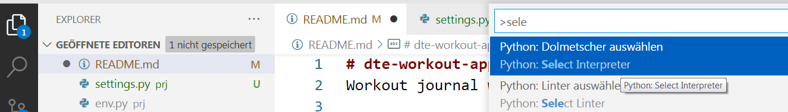
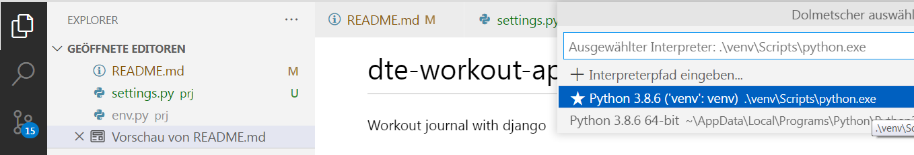
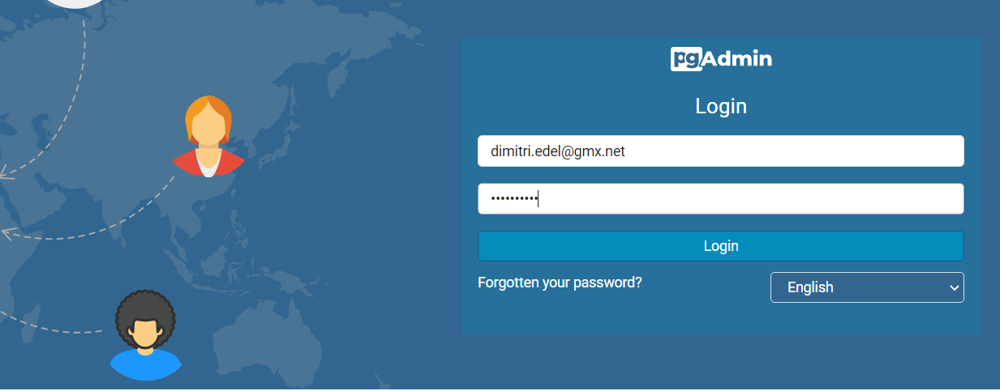
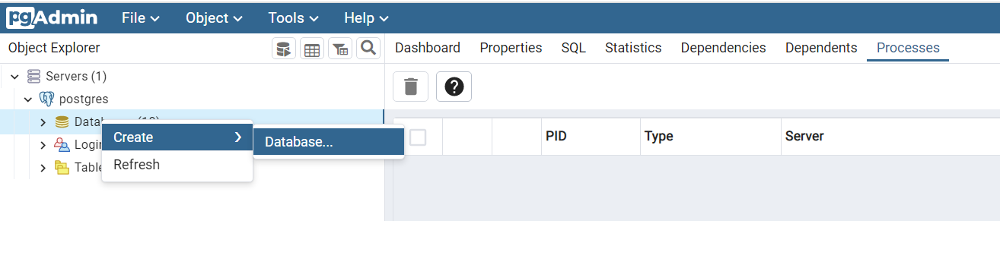
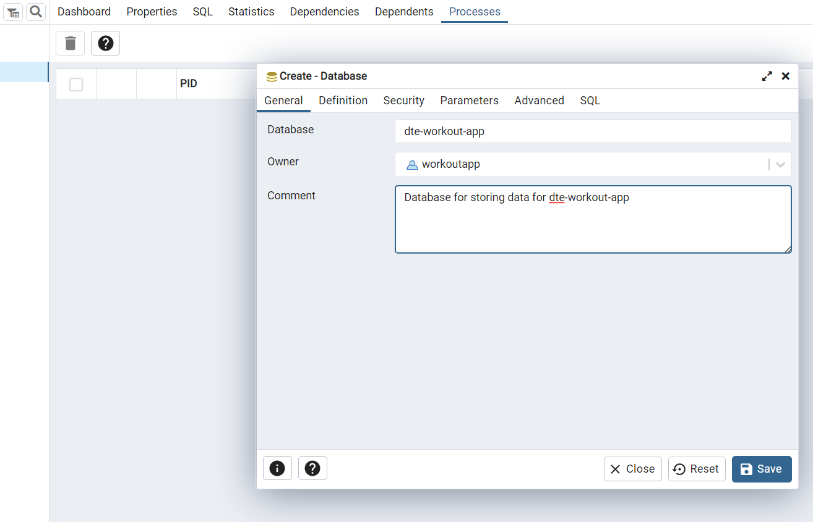
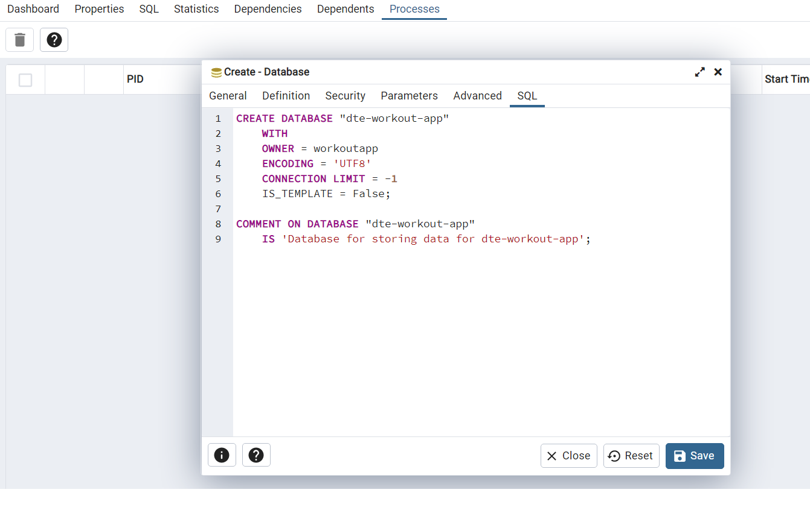
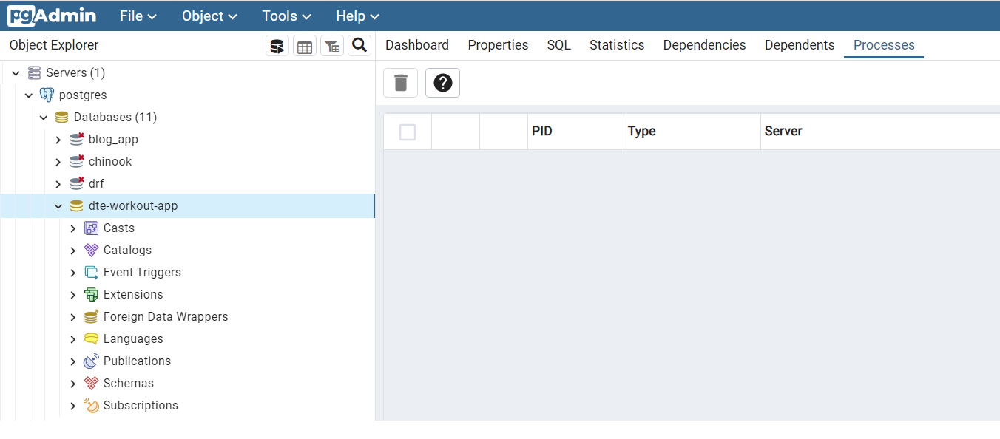
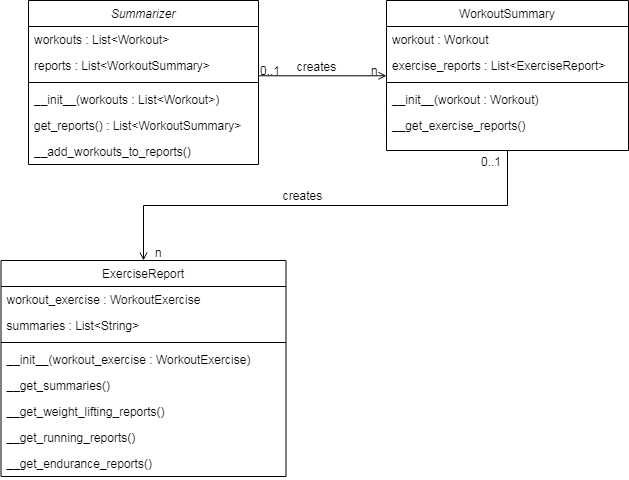

# dte-workout-app
Workout journal with django

## Pylint and PEP8
For some reason pylint gives me the no-name-in-module error for some packages, even though the classes are clearly defined in those files. I have not figured out why yet. So I decided to suppress the warnings in the code base.

## Creating django project
First and foremost, because I work locally it is good practice to set up a virtual environment, so that the packages for this project are installed into the project folder(a sub-folder named 'venv') instead of having them  installed globally on this machine.

### Setting up the environment
Step one: Create virtual environment in folder named **venv**.
Step two: Select the virtual environment in IDE. I am using VS Code on a windows workstation. So for me it is Ctrl+Shift+P followed by 'Select Interpreter'.

On a linux machine it is necessary to enter the following instruction in the terminal:
<code>source ./venv/bin/activate</code>

Step three:  Install django. I am using version 4.2.2
Step four: Install django-allauth. I am using version 0.54.0
Step five: Install psycopg2 for mapping models to database. I am using version 2.9.6
Step six: Run the startprject command in the Terminal

**Summary:**
1) <code>virtualenv venv</code>
2) **Select the interpreter from the forlder 'venv'**
3) <code>pip install Django==4.2.2</code>
4) <code>pip install django-allauth==0.54.0</code>
5) <code>pip install psycopg2==2.9.6</code>
6) <code>django-admin startproject prj .</code>

### Setting up a database for the project
For this Project I have decided to use an external database on one of the servers that I rent. It is a PostgreSQL Server with pgAdmin as a Management Tool. In order to set up a new database I need to first log in to pgAdmin.

Then I need to create a database.

Next I need to name the database and assign a user as its owner. In other words, a user that can edit the database.
I already have a user for this app, so I just need to select him from a dropdown menu. In this case the username is workoutapp and they have all the privileges that are necessary for editing this database.

Here is the code that will be executed when I press **save**.

Now the database is ready to be used. At least for django it is, because django will automatically map the models to this database when the **manage.py migrate** script is executed. Alongside all the models that I will define in the scope of this project, django will also map models from other apps that I am going to use in this project, such as django-allauth, the users for django.contrib.auth and so on.

#### Adding database to settings.py
First of all, since I am going to store the project on GitHub, I cannot publicly share the credentials used for the database. So I will store them in a file that will be **added to gitignore**. In settings.py I will only use variables that correspond to the credentials.

I need to import the **environment variables** that I defined in **env.py**.
Since, I am using a wildcard-import <code>from .env import *</code> I need to let the linter know that it is fine.
I am doing that because there are no classes defined in that file only a number of **os.eniron** assignments. 
Which you can see as a setting for pylint in form of a comment: <code># pylint: disable=wildcard-import</code>
Also,I need to override the standard SQLite engine setting in settings.py by providing my set of settings:

<code>
# pylint: disable=wildcard-import

from pathlib import Path
import os
if os.path.exists('organizer_api_prj/env.py'):
    from .env import *

...

DATABASES = {

    "default": {

        'ENGINE': 'django.db.backends.postgresql_psycopg2',

        'NAME': os.environ['DB_NAME'],

        'USER': os.environ['DB_USER'],

        'PASSWORD': os.environ['DB_PASSWORD'],

        'HOST': os.environ['DB_HOST'],

        'PORT': os.environ['DB_PORT'],
    }
}

</code>

## Setting up the project
Now that I have the project and the database for the project has been specified, I need to migrate all the django models to the database and create a superuser. All of them will be mapped to the database.

In the terminal I enter the following instructions:
1) python manage.py migrate
2) <code>python manage.py createsuperuser</code>
2) Enter username, password and confirm password

### Setting up a folder for templates
1) Create templates folder in the project folder: **prj/templates**
2) Add the folder to settings.py under TEMPLATES 
3) Create base template for the project under **prj/templates/base.html**

<code>
TEMPLATES = [

    {

        "BACKEND": "django.template.backends.django.DjangoTemplates",
        "DIRS": [BASE_DIR / 'prj/templates'],
        "APP_DIRS": True,
        "OPTIONS": {
            "context_processors": [
                "django.template.context_processors.debug",
                "django.template.context_processors.request",
                "django.contrib.auth.context_processors.auth",
                "django.contrib.messages.context_processors.messages",
            ],

        },

    },

]
</code>

### Setting up Allauth
1) Register django-allauth in settings.py under INSTALLED_APPS
2) Register alluth.url in urls.py in the project folder
3) Copy the folder /lib/site-packages/allauth/templates to the project's template folder
4) Run the **migrate** command for allauth to commit its tables to the database
5) In settings.py set SITE_ID, LOGIN_REDIRECT_URL, LOGOUT_REDIRECT_URL
6) See if it works (Test)

---
## Styles and CSS
I will store all styles for the application in a single file that will be contained in the **static/css** folder.

It is mandatory that the location of static files be specified in settings.py like so:

<code>
STATICFILES_DIRS = [
    BASE_DIR / "static",    
]
</code>

---
## Creating base template
[See Base Template](https://github.com/dimitri-edel/dte-workout-app/blob/main/prj/templates/base.html)

### Navigation Bar
The navigation bar is nested inside a **nav** tag and holds an **unordered list** with links. Using django's templating language the items of the list get rendered conditionally depending on whether or not the user is logged in.

### Messages
For messages from django.contrib.messages it is necessary to define a list of **styles** for the constants in **settings.py**

<code>

from django.contrib.messages import constants as messages

MESSAGE_TAGS = {
        messages.DEBUG: 'alert-secondary',
        messages.INFO: 'alert-info',
        messages.SUCCESS: 'alert-success',
        messages.WARNING: 'alert-warning',
        messages.ERROR: 'alert-danger',
}

</code>

---
## Authentication forms
Allauth offers an application that handles authentication, so it is not necessary to create everything from scratch.
In order to modify the looks of the forms used in the process I copied all the templates from the app in to the projects 
templates folder, as documented two sections above in **Setting up Allauth**. To make the login, logout and sign-up forms
look different from the default allauth design, I need to edit them and apply the styles that I previously prepared in
**static/css/styles.css**.
Furthermore, I need to remove a few things from those forms and add a different layout using **bootstrap**.

---
## EXERCISE APP
To add an app to a django project I ran this script in the terminal:

<code>
python manage.py startapp exercise
</code>

### Model
The exercise app contains the model for exercises, which the user can define lor later use in their workouts.
There will be three types of exercises:
1) Weight Lifting - Can be used for anything that involves lifting weights over a number of repetitions.
2) Running - Can be used for any activity that involves running or jogging over time
3) Endurance - Can be used for exercises that require to do a number of repetitions over time

**Fields:**

**owner** - User who created the exercise

**name** - Name of the exercise such as jogging, squat, etc.

**exercise_type** - Is one of the types mentioned above: Weight-Lifting, Running, Endurance

[See exercise.models.py](https://github.com/dimitri-edel/dte-workout-app/blob/main/exercise/models.py)

---
### Exercise Form
For creating and editing an exercise I will use django forms, because they offer an easy way of validating and saving the data. I will define the form in **forms.py**, whose name will be **ExerciseForm**

[See exercise.forms.py](https://github.com/dimitri-edel/dte-workout-app/blob/main/exercise/forms.py)

---
### Views
The views will cover the CRUD functionality and use templates for rendering, and be mapped to URLs.
All views for this django-app will be defined in **exercise/views.py**

[See exercise.views.py ](https://github.com/dimitri-edel/dte-workout-app/blob/main/exercise/views.py)

---
#### Create Exercise
I named the view **CreateExercise**. It has two methods. One for processing the GET-Request, wherein the form gets Instantiated and passed to the template for rendering. And one for processing the POST-Request where the form gets committed to the database if it is valid. If the form is not valid, the user will see a validation message that points out an empty field or the like.

<code>

class CreateExercise(View):

    """ View for creating an exercise """
    # Reference to the form
    exercise_form_class = ExerciseForm
    # Reference to the template
    template_name = "create_exercise.html"

    def get(self, request, *args, **kwargs):
        """ Process a GET-Request and return a rendered template"""
        # Check if the user is authenticated, if not redirect them to home page
        if not request.user.is_authenticated:
            return HttpResponseRedirect(reverse('home'))
        # Instantiate the form
        exercise_form = self.exercise_form_class()
        # Render the specified template
        return render(request, self.template_name, {"exercise_form": exercise_form})

    def post(self, request,  *args, **kwargs):
        """Process a POST-Request" for creating an exercise"""
        # Retrieve form from REQUEST
        exercise_form = self.exercise_form_class(request.POST)
        # If the form is valid
        if exercise_form.is_valid():
            # Assign the form to the current user.
            # The instance property of the forms is a reference to the model class
            # that is being used and allows us to access its properties and methods
            exercise_form.instance.owner = request.user
            # Commit the model object to the database
            exercise_form.save()
            messages.add_message(
            request, messages.SUCCESS, f"A new exercise: '{exercise_form.instance.name}'\
                 has been created   !")
            return HttpResponseRedirect(reverse("exercise_list"))
        # If the form was not valid, render the template. The workout_from will contain the
        # validation messages for the user, which had been generated upon calling the 
        # is_valid() method
        return render(request, self.template_name, {"exercise_form": exercise_form})
</code>

#### Template
[See the template exercise.templates.create_exercise.html](https://github.com/dimitri-edel/dte-workout-app/blob/main/exercise/templates/create_exercise.html)

##### Authentication check
The view contains a check for authentication in its get method. If a user is not logged in they will be redirected to the home page.

##### Test
I have created a few exercises and they were correctly committed to the database. The validation also works and will not let me submit the form unless it has the required fields. The validation messages appear as expected.

---
#### Exercise List
I named the view **ExerciseList**. The class inherits from **django.views.generic.ListView**. 
The view returns a list of exercises that belong to the user. 
The view is paginated by 5 items per page.

<code>
class ExerciseList(generic.ListView):

    """ List of exercises that belong to the user"""
    model = Exercise
    template_name = "exercise_list.html"
    paginate_by = 5

    def get_queryset(self):
        # Only retrieve datasets related to the user
        return self.model.objects.filter(owner=self.request.user.id)
</code>

##### Template
The template uses **pagination** facilities at the bottom. 

The template provides a **delete button** for each exercise.There is also a **Modal** Dialog from **bootstrap** that prompts the user to confirm deletion of an exercise.

The **name** of each exercise is wrapped inside a **link** with a fontawsome **icon**, that allows the user to open the exercise and edit it.

[See exercise.templates.exercise_list.html](https://github.com/dimitri-edel/dte-workout-app/blob/main/exercise/templates/exercise_list.html)

##### Test
The list shows exercises that belong to the user that is logged in, otherwise it comes up empty(Meaning if I enter the URL whilst not authenticated)

After adding the **DeleteExercise** view and **EditExercise** view I have tested the links in the list and they worked.
The **delete button** works. **Confirm dialog** before deleting the exercise shows up and works properly.
The items get deleted and a message that informs me about the successful deletion appears.
Clicking on the **name** of the exercise opens the **edit** page as intended.

---
#### Edit Exercise
This class is named **EditExercise**. 
The class inherits from **django.views.View**.
The **get** method extracts an object from the database and renders a template.
The **post** method extracts the form from the request and commits the data to the database.
If updating the data was successful a message will be passed to the user.
If validation errors incur then the form will be rerendered with those validation messages.

<code>
class EditExercise(View):

    """ View for editing an exercise """
    # Reference to the form
    exercise_form_class = ExerciseForm
    # Reference to the template
    template_name = "edit_exercise.html"

    def get(self, request, *args, **kwargs):
        """ Process a GET-Request"""
        exercise_id = kwargs["exercise_id"]
        # Retrieve dataset
        exercise = Exercise.objects.get(id=exercise_id)        
        # Store the id of the last object in the session
        request.session["edit_exercise_id"] = exercise_id
        # Instantiate the form
        exercise_form = self.exercise_form_class(instance=exercise)
        # Render the specified template
        return render(request, self.template_name, {"exercise_form": exercise_form})

    def post(self, request,  *args, **kwargs):
        """Process a POST-Request"""
        # Retrieve the object using the id stored in session
        edit_exercise = Exercise.objects.get(
            id=request.session["edit_exercise_id"])
        # Instantiate the form
        exercise_form = self.exercise_form_class(
            request.POST, instance=edit_exercise)
        # If the form is valid
        if exercise_form.is_valid():
            # Assign the form to the current user.
            # The instance property of the forms is a reference to the model class
            # that is being used and allows us to access its properties and methods
            exercise_form.instance.user = request.user
            # Commit the model object to the database
            exercise_form.save()
            # Let the user know about the successful update
            messages.add_message(
                request, messages.SUCCESS, f"{exercise_form.instance.name} has been updated!")
            return HttpResponseRedirect(reverse("exercise_list"))
        # If the form was not valid, render the template. The workout_from will contain
        # the validation messages for the user, which had been generated upon calling
        # the is_valid() method
        return render(request, self.template_name, {"exercise_form": exercise_form})
</code>

##### Template
The template simply renders the two fields of the form name and exercise_type. Which allows the user to change the values of these fields. It also provides a **save button** and a **Go back** button.

[See exercise.templates.edit_exercise.html](https://github.com/dimitri-edel/dte-workout-app/blob/main/exercise/templates/edit_exercise.html)

##### Testing
If the name is empty, validation message appears.
When the form is valid and gets committed to the database, a feedback message is passed to the user.

---
#### Delete Exercise
Name of class is **DeleteExercise**. 
The class inherits from **django.views.View**.
It only has one method: **get**. 
Inside the method first thing, the requested object is retrieved from the database.
Secondly, the code checks if the user requesting the delete is the actual owner of
the exercise. If not an error message is passed to the user.
Further on, the code will try to delete the exercise If there is no issues and
the exercise can be deleted, a feedback message is passed to the user.
If the deletion would conflict with data integrity, an according message will be
relayed to the user.

This view does **not** require a **template**.

<code>
class DeleteExercise(View):

    """Delete an exercise from the list of available exercises"""
    def get(self, request, exercise_id):
        """Process the GET-request for delete"""
        exercise = Exercise.objects.get(id=exercise_id)
        if exercise.owner != request.user:
            # Relay the error message to the user
            messages.add_message(
                request, messages.ERROR, "This exercise con not be deleted because \
                you are not the owner!")
            return HttpResponseRedirect(reverse("exercise_list"))

        try:
            exercise.delete()
            messages.add_message(
                request, messages.SUCCESS, f"{exercise.name} has been deleted!")
        except ProtectedError:
            # ProtectedError is raised because if the exercise is used in a workout
            # In the model WorkoutExercise the foreign key to the exercise states  
            # on_delete=models.PROTECT
            messages.add_message(
                request, messages.ERROR, "This exercise con not be deleted because \
                it is being used in a workout!")
        
        return HttpResponseRedirect(reverse("exercise_list"))

</code>

##### Testing
I have successfully deleted several exercises and the messages were relayed as expected.

---
## WORKOUT APP
To add the app to the django project I entered this command in the terminal:

<code>python manage.py startapp workout</code>

---
### Model
I defined two classes: **Workout** and **WorkoutExercise**. 

**Workout** is a representation of a workout session. Whereas, **WorkoutExercise** is a many-to-many relationship. Even though **django** offers a **Many-to-many** relationship, that solution does not quite fit the bill. Because this relationship will be used as a foreign key in another model that is yet to be defined. I did some research and have tried a few things but none of those methods worked like I needed them to. So I decided to use the good old normalization rule and defined the relationship in a separate model.
[See workout.models.py](https://github.com/dimitri-edel/dte-workout-app/blob/main/workout/models.py)

Now all that is left to do is add the app to INSTALLED_APPS in settings.py and migrate the model to the database.
<code>
python manage.py makemigrations
python manage.py migrate
</code>

---
### Forms
I defined two forms, one for each of the model classes. 
[See workout.forms.py](https://github.com/dimitri-edel/dte-workout-app/blob/main/workout/forms.py)

---
### Views

---
#### Creating and Editing a Workout session
The reason why I bunched the two view together is because upon creating a Workout session I want the user to be redirected to the page for editing the session.

I named the view for creating a workout session **StartWorkout** and the view for editing a workout session **EditWorkout**.

The **link** to **StartWorkout** will be added to the list of links in the **Navigation Bar**.

When the user clicks on **start workout** in the **Navigation Bar**, the **StartWorkout** view will be executed and will render a **template**. In this template the user will **name** the **Workout session** and click on **start**. In turn, the user will be forwarded to the **editing page**, where they can compile a list of exercises for the workout session.

[See the workout.views.py](https://github.com/dimitri-edel/dte-workout-app/blob/main/workout/views.py)

##### Templates
Template for creating a workout is called **start_workout.html**. Basically, all it does is provide a form in which user can **name** the workout session.

[See workout.templates.start_workout.html](https://github.com/dimitri-edel/dte-workout-app/blob/main/workout/templates/start_workout.html)

Template for editing a workout session is called **edit_workout.html**. The template has an editable field for the name of the workout session. It also displays a list of exercises for the workout session, provided that there is a list. If there is no list yet, then the user now has the chance to define one. It uses two forms for submitting changes, one for the **Workout** model and another for the **WorkooutExercise** model. **WorkoutExerciseForm** allows the user to pick one of the exercises they defined and add them to the workout session. If they pick an exercise from from the list of the exercises they defined and click on the **add** button, the exercises will be added to the list and appear in the list above.

[See workout.templates.edit_workout.html](https://github.com/dimitri-edel/dte-workout-app/blob/main/workout/templates/edit_workout.html)

##### Testing
I have created several workouts and they showed up in the page for editing. I could rename the workout session and also successfully add exercises to the list. I yet have to define a view for **deleting** the exercises and insert the corresponding URL into the template.

---
#### Remove an Exercise from a Workout session
The view is called **DeleteWorkoutExercise**. It gets two **parameters** passed two it via **URL**. One is the id of the workout session and the other is the id of the dataset in **WorkoutExercise** . 

##### Template
It is used in the template from editing a workout session. The link is placed inside a Modal dialog, that makes sure that the user confirms the delete.

[See workout.templates.edit_workout.html](https://github.com/dimitri-edel/dte-workout-app/blob/main/workout/templates/edit_workout.html)

##### Testing
I have opened a workout for editing and deleted a few items from it.

---
#### List of workout sessions
The view **WorkoutList** extracts all workouts that belong to the user. The **template** gets a list of **workouts** and renders the names of the workouts. Furthermore, it iterates through a list of **exercises** that are linked to the workout and renders their **name** and corresponding **type**. There are three types: Weight-Lifting, Running and Endurance which are represented with an **icon** that is sitting next to the name of the exercise. The  The list is **paginated**. 

[See the workout.views.py](https://github.com/dimitri-edel/dte-workout-app/blob/main/workout/views.py)

##### Template
[See workout.templates.workout_list](https://github.com/dimitri-edel/dte-workout-app/blob/main/workout/templates/workout_list.html)

###### Testing 
The list renders and shows all workouts that belong to the user in the way it was intended.

---
##### Delete Workout session
I have added a view **DeleteWorkout** and registered it at a **URL**. The view deletes a workout if it belongs to the user in the request.

---
#### Refactoring WorkoutList
There was some code in the **WorkoutList** view that seemed convoluted and difficult to read. It occurred to me that a better way to go is to implement computed fields directly in the model. For now, I have only added one method, which uses a property decorator for Models. The property named **exercise_list** returns a collection of **WorkoutExercise** objects that are related to a given workout session.

---
## WORKLOAD APP
Logging the actual workload for each set of an exercise.

### Timer
Timer is a class that I defined in a separate Java-Script file named **timer.js**. It will be  in the **static/js** folder.
The timer will be used for two types of workload: running and endurance. The user will  have a start button form the timer, which will turn into a stop button as soon as the timer gets started. When the timer is stopped the results will be copied to the respective field in the form that is used for adding a new set to the exercise.

---
#### Reverse the refactoring
Due to the [initial refactoring](#refactoring-workoutlist) I have run into a problem. The **list of workouts** is meant to provide summaries for each workout, so the user can see at one glance what was done in a given workout session. The problem with computed fields come down to python. Being a script language,  it initializes model classes sequentially, one by one. So I cannot reference the **Workload** model in **WorkoutExercise**. It works with **Exercise** because it is initialized **before** WorkoutExercise. To cut the long story short, I will need to create either set of classes for that purpose and have the summaries created inside the **WorkoutList** view itself. I will store the classes for creating such a list of summaries in **workout/summaries.py**. 

###### Summarizer 
This class in **workout/summaries.py** uses two other classes for storing information. It puts together a list of all workouts that belong to the user. Each item in that list is of type **WorkoutSummary**. This Summary also contains a list of reports of type **WorkloadReport**.

