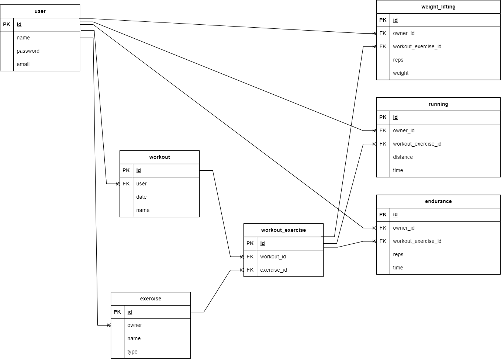
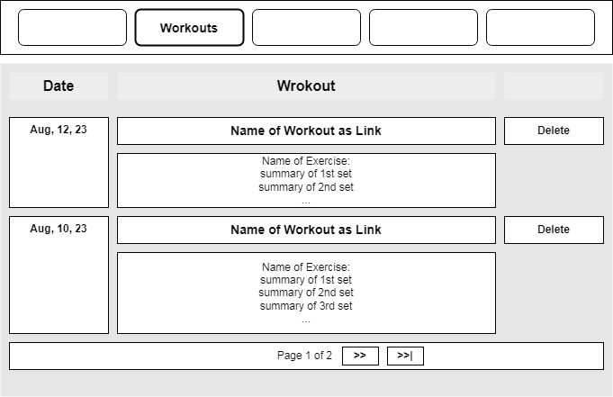

# Table of contents
- [Table of contents](#table-of-contents)
- [Introduction](#introduction)
- [ERD](#erd)
- [Model Class Diagram](#model-class-diagram)
- [User Stories (Wire-Frames)](#user-stories-wire-frames)
  - [Defining a new Exercise](#defining-a-new-exercise)
  - [User **name**s the exercise](#user-names-the-exercise)
  - [User selects the **type** of exercise from a dropdown list](#user-selects-the-type-of-exercise-from-a-dropdown-list)
  - [User clicks on **Save** button](#user-clicks-on-save-button)
  - [The list of Exercises opens and the added **exercise** appears in the **list**](#the-list-of-exercises-opens-and-the-added-exercise-appears-in-the-list)
  - [Editing an exercise](#editing-an-exercise)
  - [User clicks on **Exercises** in the **Navigation Bar**](#user-clicks-on-exercises-in-the-navigation-bar)
  - [User clicks on the **name** of exercise](#user-clicks-on-the-name-of-exercise)
  - [Viewing the list of workout sessions](#viewing-the-list-of-workout-sessions)
  - [Starting a new workout session](#starting-a-new-workout-session)
  - [Deleting a workout session from the list](#deleting-a-workout-session-from-the-list)
  - [User confirms the Deletion!](#user-confirms-the-deletion)
  - [User sees an updated list of workout sessions](#user-sees-an-updated-list-of-workout-sessions)
  - [Editing a workout session](#editing-a-workout-session)
    - [Adding exercises](#adding-exercises)
  - [User selects the exercise they want to add to the workout from a dropdown list](#user-selects-the-exercise-they-want-to-add-to-the-workout-from-a-dropdown-list)
  - [User clicks on the **Add Exercise** button.](#user-clicks-on-the-add-exercise-button)
  - [The newly added exercise appears in the list.](#the-newly-added-exercise-appears-in-the-list)
    - [Deleting an exercise from workout session](#deleting-an-exercise-from-workout-session)
  - [User clicks on **Delete** button](#user-clicks-on-delete-button)
  - [User confirms deletion](#user-confirms-deletion)
  - [User sees the updated list of exercises](#user-sees-the-updated-list-of-exercises)
    - [Renaming workout sessions](#renaming-workout-sessions)
  - [User clicks on **Rename** button](#user-clicks-on-rename-button)
  - [User enters a **new name**](#user-enters-a-new-name)
  - [User clicks on **Rename** button](#user-clicks-on-rename-button-1)
  - [The page for **editing** opens and the **new name** appears in the **heading** of the page](#the-page-for-editing-opens-and-the-new-name-appears-in-the-heading-of-the-page)
- [Pylint and PEP8](#pylint-and-pep8)
- [Creating django project](#creating-django-project)
  - [Setting up the environment](#setting-up-the-environment)
  - [Setting up a database for the project](#setting-up-a-database-for-the-project)
    - [Adding database to settings.py](#adding-database-to-settingspy)
- [Setting up the project](#setting-up-the-project)
  - [Setting up a folder for templates](#setting-up-a-folder-for-templates)
  - [Setting up Allauth](#setting-up-allauth)
- [Styles and CSS](#styles-and-css)
- [Creating base template](#creating-base-template)
  - [Navigation Bar](#navigation-bar)
  - [Messages](#messages)
- [Authentication forms](#authentication-forms)
- [EXERCISE APP](#exercise-app)
  - [Model](#model)
  - [Exercise Form](#exercise-form)
  - [Views](#views)
    - [Create Exercise](#create-exercise)
      - [Template](#template)
      - [Authentication check](#authentication-check)
      - [Testing](#testing)
    - [Exercise List](#exercise-list)
      - [Template](#template-1)
      - [Testing](#testing-1)
    - [Edit Exercise](#edit-exercise)
      - [Template](#template-2)
      - [Testing](#testing-2)
    - [Delete Exercise](#delete-exercise)
      - [Testing](#testing-3)
- [WORKOUT APP](#workout-app)
  - [Model](#model-1)
  - [Forms](#forms)
  - [Views](#views-1)
    - [Creating and Editing a Workout session](#creating-and-editing-a-workout-session)
      - [Template](#template-3)
      - [Testing](#testing-4)
    - [Renaming a Workout](#renaming-a-workout)
      - [View](#view)
      - [Template](#template-4)
      - [Testing](#testing-5)
    - [Remove an Exercise from a Workout session](#remove-an-exercise-from-a-workout-session)
      - [Template](#template-5)
      - [Testing](#testing-6)
    - [List of workout sessions](#list-of-workout-sessions)
      - [Template](#template-6)
        - [Testing](#testing-7)
      - [Delete Workout session](#delete-workout-session)
        - [Testing](#testing-8)
      - [Classes with summaries of each workout session used in the template](#classes-with-summaries-of-each-workout-session-used-in-the-template)
        - [Summarizer class](#summarizer-class)
        - [WorkoutSummary class](#workoutsummary-class)
        - [ExerciseReport class](#exercisereport-class)
          - [Class diagram](#class-diagram)
- [WEIGHT-LIFTING APP](#weight-lifting-app)
  - [Model](#model-2)
  - [Views](#views-2)
    - [Listing and adding a set of weight-lifting](#listing-and-adding-a-set-of-weight-lifting)
      - [Listing in the get-method](#listing-in-the-get-method)
      - [Adding in the post-method](#adding-in-the-post-method)
      - [Template](#template-7)
      - [Testing](#testing-9)
    - [Deleting a weight-lifting set](#deleting-a-weight-lifting-set)
  - [Testing](#testing-10)
  - 
- [RUNNING APP](#running-app)
  - [Model](#model-3)
  - [Views](#views-3)
    - [Listing and adding a set](#listing-and-adding-a-set)
      - [Listing in the get-method](#listing-in-the-get-method-1)
      - [Adding in the post-method](#adding-in-the-post-method-1)
      - [Template](#template-8)
      - [Testing](#testing-11)
    - [Deleting a running set](#deleting-a-running-set)
      - [Testing](#testing-12)
- [ENDURANCE APP](#endurance-app)
  - [Logging the actual workload for each set of an exercise of type Endurance.](#logging-the-actual-workload-for-each-set-of-an-exercise-of-type-endurance)
  - [Model](#model-4)
  - [Views](#views-4)
    - [Listing and adding a set](#listing-and-adding-a-set-1)
      - [Listing in the get-method](#listing-in-the-get-method-2)
      - [Adding in the post-method](#adding-in-the-post-method-2)
  - [Template](#template-9)
  - [Testing](#testing-13)
- [Timer JavaScript](#timer-javascript)
  - [Testing](#testing-14)
- [MANUAL TESTS](#manual-tests)
  - [Exercise List](#exercise-list-1)
  - [Create Exercise](#create-exercise-1)
  - [Update Exercise](#update-exercise)
  - [Delete Exercise](#delete-exercise-1)
  - [Workout List](#workout-list)
  - [Start Workout](#start-workout)
  - [Edit Workout](#edit-workout)
- [Rename Workout](#rename-workout)
  - [Delete Workout](#delete-workout)
- [CREDITS](#credits)
  
# Introduction

---
# ERD
The diagram depicts the actual tables in the database. Only, django will add the name of the respective app, which the model was declared within, at the beginning of each table name.

# Model Class Diagram
The ERD shows the relationships among tables, which remains the same among model classes. But for the sake of simplicity I drew up the Class Diagram, which **excludes** the relationship to the **User**. It makes it easier to see how the models are actually related to each other.

[Table of Contents](#table-of-contents)

---
# User Stories (Wire-Frames)

## Defining a new Exercise

- 1) User clicks on **Exercises** in the **Navigation Bar**
- 2) User clicks on **New Exercise** button

User **name**s the exercise
---

User selects the **type** of exercise from a dropdown list
---

User clicks on **Save** button
---

The list of Exercises opens and the added **exercise** appears in the **list**
---

---
## Editing an exercise

User clicks on **Exercises** in the **Navigation Bar**
---

---

User clicks on the **name** of exercise
---

---
## Viewing the list of workout sessions

|         |       |       |
|---------|-------|-------|
| [Template](#template-6) | [View](#list-of-workout-sessions) | [Table of Contents](#table-of-contents) | 

---
## Starting a new workout session

|         |       |       |
|---------|-------|-------|
| [Template](#template) | [View](#creating-and-editing-a-workout-session)  | [Table of Contents](#table-of-contents) | [Table of Contents](#table-of-contents) | 

---
## Deleting a workout session from the list
User clicks on the Delete button, which is sitting in the same row as the link with the name of the session.

User confirms the Deletion!
---

User sees an updated list of workout sessions
---

|         |       |       |
|---------|-------|-------|
| No template | [View](#delete-workout-session) |[Table of Contents](#table-of-contents) |

---
## Editing a workout session

---
### Adding exercises

- 1) User clicks on **Workouts** in the **Navigation Bar**.
- 2) User clicks on the workout they want to edit

User selects the exercise they want to add to the workout from a dropdown list
---

User clicks on the **Add Exercise** button.
---

The newly added exercise appears in the list.
---

---
### Deleting an exercise from workout session

- 1) User clicks on **Workouts** in the **Navigation Bar**.
- 2) User clicks on the workout they want to edit

User clicks on **Delete** button
---

User confirms deletion
---

User sees the updated list of exercises
---

---
### Renaming workout sessions

- 1) User clicks on **Workouts** in the **Navigation Bar**.
- 2) User clicks on the workout they want to edit

User clicks on **Rename** button
---

User enters a **new name**
---

User clicks on **Rename** button
---

The page for **editing** opens and the **new name** appears in the **heading** of the page
---

[Table of Contents](#table-of-contents)

---
# Pylint and PEP8
For some reason pylint gives me the no-name-in-module error for some packages, even though the classes are clearly defined in those files. I have not figured out why yet. So I decided to suppress the warnings in the code base.

[Table of Contents](#table-of-contents)

---
# Creating django project
First and foremost, because I work locally it is good practice to set up a virtual environment, so that the packages for this project are installed into the project folder(a sub-folder named 'venv') instead of having them  installed globally on this machine.

[Table of Contents](#table-of-contents)

---
## Setting up the environment
Step one: Create virtual environment in folder named **venv**.
Step two: Select the virtual environment in IDE. I am using VS Code on a windows workstation. So for me it is Ctrl+Shift+P followed by 'Select Interpreter'.

[Table of Contents](#table-of-contents)

On a linux machine it is necessary to enter the following instruction in the terminal:
<code>source ./venv/bin/activate</code>

Step three:  Install django. I am using version 4.2.2
Step four: Install django-allauth. I am using version 0.54.0
Step five: Install psycopg2 for mapping models to database. I am using version 2.9.6
Step six: Run the startprject command in the Terminal

**Summary:**
1) <code>virtualenv venv</code>
2) **Select the interpreter from the forlder 'venv'**
3) <code>pip install Django==4.2.2</code>
4) <code>pip install django-allauth==0.54.0</code>
5) <code>pip install psycopg2==2.9.6</code>
6) <code>django-admin startproject prj .</code>

---
## Setting up a database for the project
For this Project I have decided to use an external database on one of the servers that I rent. It is a PostgreSQL Server with pgAdmin as a Management Tool. In order to set up a new database I need to first log in to pgAdmin.

Then I need to create a database.

Next I need to name the database and assign a user as its owner. In other words, a user that can edit the database.
I already have a user for this app, so I just need to select him from a dropdown menu. In this case the username is workoutapp and they have all the privileges that are necessary for editing this database.

Here is the code that will be executed when I press **save**.

Now the database is ready to be used. At least for django it is, because django will automatically map the models to this database when the **manage.py migrate** script is executed. Alongside all the models that I will define in the scope of this project, django will also map models from other apps that I am going to use in this project, such as django-allauth, the users for django.contrib.auth and so on.

[Table of Contents](#table-of-contents)

---
### Adding database to settings.py
First of all, since I am going to store the project on GitHub, I cannot publicly share the credentials used for the database. So I will store them in a file that will be **added to gitignore**. In settings.py I will only use variables that correspond to the credentials.

I need to import the **environment variables** that I defined in **env.py**.
Since, I am using a wildcard-import <code>from .env import *</code> I need to let the linter know that it is fine.
I am doing that because there are no classes defined in that file only a number of **os.eniron** assignments. 
Which you can see as a setting for pylint in form of a comment: <code>\# pylint: disable=wildcard-import</code>
Also,I need to override the standard SQLite engine setting in settings.py by providing my set of settings:

<code>
\#pylint: disable=wildcard-import

from pathlib import Path
import os
if os.path.exists('organizer_api_prj/env.py'):
    from .env import *

...

DATABASES = {

    "default": {

        'ENGINE': 'django.db.backends.postgresql_psycopg2',

        'NAME': os.environ['DB_NAME'],

        'USER': os.environ['DB_USER'],

        'PASSWORD': os.environ['DB_PASSWORD'],

        'HOST': os.environ['DB_HOST'],

        'PORT': os.environ['DB_PORT'],
    }
}

</code>

[Table of Contents](#table-of-contents)

---
# Setting up the project
Now that I have the project and the database for the project has been specified, I need to migrate all the django models to the database and create a superuser. All of them will be mapped to the database.

In the terminal I enter the following instructions:
1) python manage.py migrate
2) <code>python manage.py createsuperuser</code>
2) Enter username, password and confirm password

---
## Setting up a folder for templates
1) Create templates folder in the project folder: **prj/templates**
2) Add the folder to settings.py under TEMPLATES 
3) Create base template for the project under **prj/templates/base.html**

<code>
TEMPLATES = [

    {

        "BACKEND": "django.template.backends.django.DjangoTemplates",
        "DIRS": [BASE_DIR / 'prj/templates'],
        "APP_DIRS": True,
        "OPTIONS": {
            "context_processors": [
                "django.template.context_processors.debug",
                "django.template.context_processors.request",
                "django.contrib.auth.context_processors.auth",
                "django.contrib.messages.context_processors.messages",
            ],

        },

    },

]
</code>

[Table of Contents](#table-of-contents)

---
## Setting up Allauth
1) Register django-allauth in settings.py under INSTALLED_APPS
2) Register alluth.url in urls.py in the project folder
3) Copy the folder /lib/site-packages/allauth/templates to the project's template folder
4) Run the **migrate** command for allauth to commit its tables to the database
5) In settings.py set SITE_ID, LOGIN_REDIRECT_URL, LOGOUT_REDIRECT_URL
6) See if it works (Test)

---
# Styles and CSS
I will store all styles for the application in a single file that will be contained in the **static/css** folder.

It is mandatory that the location of static files be specified in settings.py like so:

<code>
STATICFILES_DIRS = [
    BASE_DIR / "static",    
]
</code>

[Table of Contents](#table-of-contents)

---
# Creating base template
[See Base Template](https://github.com/dimitri-edel/dte-workout-app/blob/main/prj/templates/base.html)

## Navigation Bar
The navigation bar is nested inside a **nav** tag and holds an **unordered list** with links. Using django's templating language the items of the list get rendered conditionally depending on whether or not the user is logged in.

[Table of Contents](#table-of-contents)

## Messages
For messages from django.contrib.messages it is necessary to define a list of **styles** for the constants in **settings.py**

<code>

from django.contrib.messages import constants as messages

MESSAGE_TAGS = {
        messages.DEBUG: 'alert-secondary',
        messages.INFO: 'alert-info',
        messages.SUCCESS: 'alert-success',
        messages.WARNING: 'alert-warning',
        messages.ERROR: 'alert-danger',
}

</code>

[Table of Contents](#table-of-contents)

---
# Authentication forms
Allauth offers an application that handles authentication, so it is not necessary to create everything from scratch.
In order to modify the looks of the forms used in the process I copied all the templates from the app in to the projects 
templates folder, as documented two sections above in **Setting up Allauth**. To make the login, logout and sign-up forms
look different from the default allauth design, I need to edit them and apply the styles that I previously prepared in
**static/css/styles.css**.
Furthermore, I need to remove a few things from those forms and add a different layout using **bootstrap**.

[Table of Contents](#table-of-contents)

---
# EXERCISE APP
To add an app to a django project I ran this script in the terminal:

<code>
python manage.py startapp exercise
</code>

## Model
The exercise app contains the model for exercises, which the user can define lor later use in their workouts.
There will be three types of exercises:
1) Weight Lifting - Can be used for anything that involves lifting weights over a number of repetitions.
2) Running - Can be used for any activity that involves running or jogging over time
3) Endurance - Can be used for exercises that require to do a number of repetitions over time

**Fields:**

**owner** - User who created the exercise

**name** - Name of the exercise such as jogging, squat, etc.

**exercise_type** - Is one of the types mentioned above: Weight-Lifting, Running, Endurance

[See exercise.models.py](https://github.com/dimitri-edel/dte-workout-app/blob/main/exercise/models.py)

[Table of Contents](#table-of-contents)

---
## Exercise Form
For creating and editing an exercise I will use django forms, because they offer an easy way of validating and saving the data. I will define the form in **forms.py**, whose name will be **ExerciseForm**

[See exercise.forms.py](https://github.com/dimitri-edel/dte-workout-app/blob/main/exercise/forms.py)

[Table of Contents](#table-of-contents)

---
## Views
The views will cover the CRUD functionality and use templates for rendering, and be mapped to URLs.
All views for this django-app will be defined in **exercise/views.py**

[See exercise.views.py ](https://github.com/dimitri-edel/dte-workout-app/blob/main/exercise/views.py)

[Table of Contents](#table-of-contents)

---
### Create Exercise
I named the view **CreateExercise**. It has two methods. One for processing the GET-Request, wherein the form gets Instantiated and passed to the template for rendering. And one for processing the POST-Request where the form gets committed to the database if it is valid. If the form is not valid, the user will see a validation message that points out an empty field or the like.

<code>

class CreateExercise(View):

    """ View for creating an exercise """
    # Reference to the form
    exercise_form_class = ExerciseForm
    # Reference to the template
    template_name = "create_exercise.html"

    def get(self, request, *args, **kwargs):
        """ Process a GET-Request and return a rendered template"""
        # Check if the user is authenticated, if not redirect them to home page
        if not request.user.is_authenticated:
            return HttpResponseRedirect(reverse('home'))
        # Instantiate the form
        exercise_form = self.exercise_form_class()
        # Render the specified template
        return render(request, self.template_name, {"exercise_form": exercise_form})

    def post(self, request,  *args, **kwargs):
        """Process a POST-Request" for creating an exercise"""
        # Retrieve form from REQUEST
        exercise_form = self.exercise_form_class(request.POST)
        # If the form is valid
        if exercise_form.is_valid():
            # Assign the form to the current user.
            # The instance property of the forms is a reference to the model class
            # that is being used and allows us to access its properties and methods
            exercise_form.instance.owner = request.user
            # Commit the model object to the database
            exercise_form.save()
            messages.add_message(
            request, messages.SUCCESS, f"A new exercise: '{exercise_form.instance.name}'\
                 has been created   !")
            return HttpResponseRedirect(reverse("exercise_list"))
        # If the form was not valid, render the template. The workout_from will contain the
        # validation messages for the user, which had been generated upon calling the 
        # is_valid() method
        return render(request, self.template_name, {"exercise_form": exercise_form})
</code>

#### Template

|   |   |   |
|---|---|---|
| [Open Template in Browser](https://github.com/dimitri-edel/dte-workout-app/blob/main/exercise/templates/create_exercise.html)| [User Story](#starting-a-new-workout-session) | [Table of Contents](#table-of-contents) |

#### Authentication check
The view contains a check for authentication in its get method. If a user is not logged in they will be redirected to the home page.

#### Testing
I have created a few exercises and they were correctly committed to the database. The validation also works and will not let me submit the form unless it has the required fields. The validation messages appear as expected.

[See Details of Testing](#create-exercise)

[Table of Contents](#table-of-contents)

---
### Exercise List
I named the view **ExerciseList**. The class inherits from **django.views.generic.ListView**. 
The view returns a list of exercises that belong to the user. 
The view is paginated by 5 items per page.

<code>
class ExerciseList(generic.ListView):

    """ List of exercises that belong to the user"""
    model = Exercise
    template_name = "exercise_list.html"
    paginate_by = 5

    def get_queryset(self):
        # Only retrieve datasets related to the user
        return self.model.objects.filter(owner=self.request.user.id)
</code>

#### Template
The template uses **pagination** facilities at the bottom. 

The template provides a **delete button** for each exercise.There is also a **Modal** Dialog from **bootstrap** that prompts the user to confirm deletion of an exercise.

The **name** of each exercise is wrapped inside a **link** with a fontawsome **icon**, that allows the user to open the exercise and edit it.

[See exercise.templates.exercise_list.html](https://github.com/dimitri-edel/dte-workout-app/blob/main/exercise/templates/exercise_list.html)

[Table of Contents](#table-of-contents)

#### Testing
The list shows exercises that belong to the user that is logged in, otherwise it comes up empty(Meaning if I enter the URL whilst not authenticated)

[See Details of Testing](#exercise-list)

[Table of Contents](#table-of-contents)

After adding the **DeleteExercise** view and **EditExercise** view I have tested the links in the list and they worked.
The **delete button** works. **Confirm dialog** before deleting the exercise shows up and works properly.
The items get deleted and a message that informs me about the successful deletion appears.
Clicking on the **name** of the exercise opens the **edit** page as intended.

---
### Edit Exercise
This class is named **EditExercise**. 
The class inherits from **django.views.View**.
The **get** method extracts an object from the database and renders a template.
The **post** method extracts the form from the request and commits the data to the database.
If updating the data was successful a message will be passed to the user.
If validation errors incur then the form will be rerendered with those validation messages.

<code>
class EditExercise(View):

    """ View for editing an exercise """
    # Reference to the form
    exercise_form_class = ExerciseForm
    # Reference to the template
    template_name = "edit_exercise.html"

    def get(self, request, *args, **kwargs):
        """ Process a GET-Request"""
        exercise_id = kwargs["exercise_id"]
        # Retrieve dataset
        exercise = Exercise.objects.get(id=exercise_id)        
        # Store the id of the last object in the session
        request.session["edit_exercise_id"] = exercise_id
        # Instantiate the form
        exercise_form = self.exercise_form_class(instance=exercise)
        # Render the specified template
        return render(request, self.template_name, {"exercise_form": exercise_form})

    def post(self, request,  *args, **kwargs):
        """Process a POST-Request"""
        # Retrieve the object using the id stored in session
        edit_exercise = Exercise.objects.get(
            id=request.session["edit_exercise_id"])
        # Instantiate the form
        exercise_form = self.exercise_form_class(
            request.POST, instance=edit_exercise)
        # If the form is valid
        if exercise_form.is_valid():
            # Assign the form to the current user.
            # The instance property of the forms is a reference to the model class
            # that is being used and allows us to access its properties and methods
            exercise_form.instance.user = request.user
            # Commit the model object to the database
            exercise_form.save()
            # Let the user know about the successful update
            messages.add_message(
                request, messages.SUCCESS, f"{exercise_form.instance.name} has been updated!")
            return HttpResponseRedirect(reverse("exercise_list"))
        # If the form was not valid, render the template. The workout_from will contain
        # the validation messages for the user, which had been generated upon calling
        # the is_valid() method
        return render(request, self.template_name, {"exercise_form": exercise_form})
</code>

[Table of Contents](#table-of-contents)

---
#### Template
The template simply renders the two fields of the form name and exercise_type. Which allows the user to change the values of these fields. It also provides a **save button** and a **Go back** button.

[See exercise.templates.edit_exercise.html](https://github.com/dimitri-edel/dte-workout-app/blob/main/exercise/templates/edit_exercise.html)

[Table of Contents](#table-of-contents)

---
#### Testing
If the name is empty, validation message appears.
When the form is valid and gets committed to the database, a feedback message is passed to the user.

[See Details of Testing](#update-exercise)

[Table of Contents](#table-of-contents)

---
### Delete Exercise
Name of class is **DeleteExercise**. 
The class inherits from **django.views.View**.
It only has one method: **get**. 
Inside the method first thing, the requested object is retrieved from the database.
Secondly, the code checks if the user requesting the delete is the actual owner of
the exercise. If not an error message is passed to the user.
Further on, the code will try to delete the exercise If there is no issues and
the exercise can be deleted, a feedback message is passed to the user.
If the deletion would conflict with data integrity, an according message will be
relayed to the user.

This view does **not** require a **template**.

<code>
class DeleteExercise(View):

    """Delete an exercise from the list of available exercises"""
    def get(self, request, exercise_id):
        """Process the GET-request for delete"""
        exercise = Exercise.objects.get(id=exercise_id)
        if exercise.owner != request.user:
            # Relay the error message to the user
            messages.add_message(
                request, messages.ERROR, "This exercise con not be deleted because \
                you are not the owner!")
            return HttpResponseRedirect(reverse("exercise_list"))

        try:
            exercise.delete()
            messages.add_message(
                request, messages.SUCCESS, f"{exercise.name} has been deleted!")
        except ProtectedError:
            # ProtectedError is raised because if the exercise is used in a workout
            # In the model WorkoutExercise the foreign key to the exercise states  
            # on_delete=models.PROTECT
            messages.add_message(
                request, messages.ERROR, "This exercise con not be deleted because \
                it is being used in a workout!")
        
        return HttpResponseRedirect(reverse("exercise_list"))

</code>

---
#### Testing
I have successfully deleted several exercises and the messages were relayed as expected.

[See Details of Testing](#delete-exercise)

[Table of Contents](#table-of-contents)

---
# WORKOUT APP
To add the app to the django project I entered this command in the terminal:

<code>python manage.py startapp workout</code>

---
## Model
I defined two classes: **Workout** and **WorkoutExercise**. 

**Workout** is a representation of a workout session. Whereas, **WorkoutExercise** is a many-to-many relationship. Even though **django** offers a **Many-to-many** relationship, that solution does not quite fit the bill. Because this relationship will be used as a foreign key in another model that is yet to be defined. I did some research and have tried a few things but none of those methods worked like I needed them to. So I decided to use the good old normalization rule and defined the relationship in a separate model.
[See workout.models.py](https://github.com/dimitri-edel/dte-workout-app/blob/main/workout/models.py)

Now all that is left to do is add the app to INSTALLED_APPS in settings.py and migrate the model to the database.
<code>
python manage.py makemigrations
python manage.py migrate
</code>

---
## Forms
I defined two forms, one for each of the model classes. 
[See workout.forms.py](https://github.com/dimitri-edel/dte-workout-app/blob/main/workout/forms.py)

[Table of Contents](#table-of-contents)

---
## Views

---
### Creating and Editing a Workout session
The reason why I bunched the two view together is because upon creating a Workout session I want the user to be redirected to the page for editing the session.

I named the view for creating a workout session **StartWorkout** and the view for editing a workout session **EditWorkout**.

The **link** to **StartWorkout** will be added to the list of links in the **Navigation Bar**.

When the user clicks on **start workout** in the **Navigation Bar**, the **StartWorkout** view will be executed and will render a **template**. In this template the user will **name** the **Workout session** and click on **start**. In turn, the user will be forwarded to the **editing page**, where they can compile a list of exercises for the workout session.

|   |   |   |
|---|---|---|
| [Open views.py in Browser](https://github.com/dimitri-edel/dte-workout-app/blob/main/workout/views.py) | [User Story](#starting-a-new-workout-session) | [Table of Contents](#table-of-contents) |

---
#### Template
Template for creating a workout is called **start_workout.html**. Basically, all it does is provide a form in which user can **name** the workout session.

Template for editing a workout session is called **edit_workout.html**. The top most row contains a **Rename** button, which when clicked will open a corresponding page, that allows the user to rename the workout. [See the View](#renaming-a-workout).It displays a list of exercises for the workout session, provided that there is a list. If there is no list yet, then the user now has the chance to define one. It uses  the **WorkoutExercise** model, which allows the user to pick one of the exercises they defined and add them to the workout session. If they pick an exercise from from the list of the exercises they defined and click on the **add** button, the exercises will be added to the list and appear in the list above.

|   |   |   |   |   |
|---|---|---|---|---|
| [Template for creating](https://github.com/dimitri-edel/dte-workout-app/blob/main/workout/templates/start_workout.html) | [Template for editing](https://github.com/dimitri-edel/dte-workout-app/blob/main/workout/templates/edit_workout.html) |   [User Story for creating](#starting-a-new-workout-session) | [User Story for editing](#editing-a-workout-session)  | [Table of Contents](#table-of-contents) |

---
#### Testing
I have created several workouts and they showed up in the page for editing. I could rename the workout session and also successfully add exercises to the list. I yet have to define a view for **deleting** the exercises and insert the corresponding URL into the template.

[See Details of Testing Creating a Workout](#start-workout)

[See Details of Testing Editing a Workout](#edit-workout)

[Table of Contents](#table-of-contents)

---
### Renaming a Workout

#### View
The View for renaming workouts is **RenameWorkout**. It renders a **WorkoutForm** upon a GET-Request. 
The POST-Request is processed in the usual way the form is validated. If it is valid, firstly it will be commit to the database. Secondly, the user will get redirected back to the **edit_workout.html** page.

If the form is not valid a validation message will appear in the browser and form will not be submitted.

---
#### Template
The template **rename_workout.html** is basically a copy of **create_workout.html** with a few minor changes.

#### Testing

[See Details of Testing](#rename-workout)

[Table of Contents](#table-of-contents)

---
### Remove an Exercise from a Workout session
The view is called **DeleteWorkoutExercise**. It gets two **parameters** passed two it via **URL**. One is the id of the workout session and the other is the id of the dataset in **WorkoutExercise** . 

#### Template
It is used in the template from editing a workout session. The link is placed inside a Modal dialog, that makes sure that the user confirms the delete.

[See workout.templates.edit_workout.html](https://github.com/dimitri-edel/dte-workout-app/blob/main/workout/templates/edit_workout.html)

[Table of Contents](#table-of-contents)

#### Testing
I have opened a workout for editing and deleted a few items from it.

---
### List of workout sessions
The view **WorkoutList** extracts all workouts that belong to the user. The **template** gets a list of **workouts** and renders the names of the workouts. Furthermore, it iterates through a list of **exercises** that are linked to the workout and renders their **name** and corresponding **type**. There are three types: Weight-Lifting, Running and Endurance which are represented with an **icon** that is sitting next to the name of the exercise. The  The list is **paginated**. 

[See the workout.views.py](https://github.com/dimitri-edel/dte-workout-app/blob/main/workout/views.py)

[Table of Contents](#table-of-contents)

#### Template
|   |   |   |
|---|---|---|
| [Open template in Browser](https://github.com/dimitri-edel/dte-workout-app/blob/main/workout/templates/workout_list.html) | [User Story](#viewing-the-list-of-workout-sessions) | [Table of Contents](#table-of-contents) |

##### Testing 
The list renders and shows all workouts that belong to the user in the way it was intended.
|   |   |
|---|---|
| [Details of Testing](#workout-list) |[Table of Contents](#table-of-contents) |

---
#### Delete Workout session
I have added a view **DeleteWorkout** and registered it at a **URL**. The view deletes a workout if it belongs to the user in the request.

|   |   |
|---|---|
| [User Story](#deleting-a-workout-session-from-the-list) |[Table of Contents](#table-of-contents) |

##### Testing
The workouts can be successfully deleted from the list.

[See Details of Testing](#delete-workout)

[Table of Contents](#table-of-contents)

---
#### Classes with summaries of each workout session used in the template
Initially I intended to use computed fields for this purpose, yet I have run into a problem. The **list of workouts** is meant to provide summaries for each workout, so the user can see at one glance what was done in a given workout session. The problem with computed fields comes down to python. Being a script language,  it initializes model classes sequentially, one by one. So I cannot reference  **WeightLifting, Running** or **Endurance** models in **WorkoutExercise**. To cut the long story short, I will need to create a set of classes for that purpose and have the summaries created inside the **WorkoutList** view itself. I will store the classes for creating such a list of summaries in **workout/summaries.py**. 

---
##### Summarizer class
This class is the one **used** in the **view**. It takes a **list of Workout objects** as a parameter in the **constructor** and creates an iterable list of objects of type **WorkoutSummary**. The list contains all the objects required for rendering all entities used in the **template**, such as the name of the workout session, a list of exercises performed during the session and summarized descriptions of each set performed during an exercise.

This class **Summarizer** in **workout/summaries.py** is initialized using the List of Workouts passed to the constructor. It puts together a list of all workouts that belong to the user. Each item in that list is of type **WorkoutSummary**. This Summary also contains a list of reports of type **ExerciseReport**.

---
##### WorkoutSummary class
The class is **initialized** using the **Workout** object passed to the **constructor**. It iterates through the list of exercises used in the Workout. The list is acquired from a **property** of **Workout** named **exercise_list**. The exercise **list** contains objects of type **WorkoutExercise**, which represents a relationship between Workout and Exercises model classes. During the iteration for each exercise found in the relationship a **ExerciseReport** is created and appended to the property named **reports**.

---
##### ExerciseReport class
The class is **initialized** using the **WorkoutExercise** object passed to the **constructor**. In turn it compiles a list of summaries for each set of an exercise that is linked to the relationship received in the constructor.

###### Class diagram

[Table of Contents](#table-of-contents)

---
# WEIGHT-LIFTING APP
Logging the actual workload for each set of an exercise of type weight-lifting.

---
## Model
The model has four fields: owner, workout_exercise, reps, weight. 
**owner** is the user who created the dataset
**workout_exercise** is the relationship to exercise
**reps** is the number of repetitions in the set
**weight** is the weight used

[See models.py](https://github.com/dimitri-edel/dte-workout-app/blob/main/weight_lifting/models.py)

[Table of Contents](#table-of-contents)

---
## Views
It is only necessary to have two views. One for listing and adding sets and one for deleting sets. There will be no view for updating sets, because changing results retrospectively does not make sense.

[See views.py](https://github.com/dimitri-edel/dte-workout-app/blob/main/weight_lifting/views.py)

[Table of Contents](#table-of-contents)

---
### Listing and adding a set of weight-lifting
**WeightLiftingList** handles listing the sets in its **get**-method and **adding** a set in the **post** method.

#### Listing in the get-method 
Firstly, the **id** of the relationship, which was passed as a parameter in the URL, is retrieved from **kwargs** and stored in **workout_exercise_id**.
Secondly, the object of the **relationship** is retrieved from **WorkoutExercise** and stored in **workout_exercise**.
Thirdly, an empty form for a new set is created. The form will be used in the template in order to add the next set and stored in **weight_lifting_form**.
Fourthly, a list of **weight-lifting** sets that are linked to the previously retrieved **WorkoutExercise** relationship is retrieved and stored in **weight_lifting_list**.
Then, the respective exercise object is retrieved and stored in **exercise**. The object will be used to display the name of the exercise in the heading.

#### Adding in the post-method
Firstly, the object of the **relationship** is retrieved from **WorkoutExercise** and stored in **workout_exercise**.
Secondly, **weight_lifting_form** is retrieved from the **post-request**. 
Thirdly, a list of **weight-lifting** sets ,that are linked to the previously retrieved **WorkoutExercise** relationship, is retrieved and stored in **weight_lifting_list**.
Fourthly, the respective exercise object is retrieved and stored in **exercise**. The object will be used to display the name of the exercise in the heading.
Then, if the submitted form is **valid** the **__save_form()** method is called, which saves the form.
Lastly, the template is rendered.

---
#### Template

[View the template](https://github.com/dimitri-edel/dte-workout-app/blob/main/weight_lifting/templates/weight-lifting-list.html)

[Table of Contents](#table-of-contents)

---
#### Testing

---
### Deleting a weight-lifting set
The view deletes the weight-lifting-set whose id is passed as a parameter under **exercise_set_id**.
It will only delete an item if the owner is the same as the user in the request.
In the end it redirects the user back to the list of sets using the **workout_exercise_id** from the list of parameters.

---
## Testing

##
---
# RUNNING APP
Logging the actual workload for each set of an exercise of type Running.

---
## Model
The model has four fields: owner, workout_exercise, distance, time. 
**owner** is the user who created the dataset
**workout_exercise** is the relationship to exercise
**distance** is the distance covered during the set
**time** is amount of time it took to traverse the distance

[View models.py](https://github.com/dimitri-edel/dte-workout-app/blob/main/running/models.py)

[Table of Contents](#table-of-contents)

---
## Views
### Listing and adding a set
**RunningList** handles listing the sets in its **get**-method and **adding** a set in the **post** method.

[View views.py](https://github.com/dimitri-edel/dte-workout-app/blob/main/running/views.py)

[Table of Contents](#table-of-contents)

#### Listing in the get-method 
Firstly, the **id** of the relationship, which was passed as a parameter in the URL, is retrieved from **kwargs** and stored in **workout_exercise_id**.
Secondly, the object of the **relationship** is retrieved from **WorkoutExercise** and stored in **workout_exercise**.
Thirdly, an empty form for a new set is created. The form will be used in the template in order to add the next set and stored in **running_form**.
Fourthly, a list of **running** sets that are linked to the previously retrieved **WorkoutExercise** relationship is retrieved and stored in **running_list**.
Then, the respective exercise object is retrieved and stored in **exercise**. The object will be used to display the name of the exercise in the heading.

#### Adding in the post-method
Firstly, the object of the **relationship** is retrieved from **WorkoutExercise** and stored in **workout_exercise**.
Secondly, **running_form** is retrieved from the **post-request**. 
Thirdly, a list of **running** sets ,that are linked to the previously retrieved **WorkoutExercise** relationship, is retrieved and stored in **running_list**.
Fourthly, the respective exercise object is retrieved and stored in **exercise**. The object will be used to display the name of the exercise in the heading.
Then, if the submitted form is **valid** the **__save_form()** method is called, which saves the form.
Lastly, the template is rendered.

---
#### Template

[View running-list.html](https://github.com/dimitri-edel/dte-workout-app/blob/main/running/templates/running-list.html)

[Table of Contents](#table-of-contents)

---
#### Testing

---
### Deleting a running set
The view deletes the running-set whose id is passed as a parameter under **exercise_set_id**.
It will only delete an item if the owner is the same as the user in the request.
In the end it redirects the user back to the list of sets using the **workout_exercise_id** from the list of parameters.

---
#### Testing

---
# ENDURANCE APP
Logging the actual workload for each set of an exercise of type Endurance.
---
## Model
The model has four fields: owner, workout_exercise, reps, time. 
**owner** is the user who created the dataset
**workout_exercise** is the relationship to exercise
**reps** is the number of repetitions performed during the set
**time** is amount of time it took to finish the set

[View models.py](https://github.com/dimitri-edel/dte-workout-app/blob/main/endurance/models.py)

[Table of Contents](#table-of-contents)

---
## Views
### Listing and adding a set
**RunningList** handles listing the sets in its **get**-method and **adding** a set in the **post** method.

[View views.py](https://github.com/dimitri-edel/dte-workout-app/blob/main/endurance/views.py)

[Table of Contents](#table-of-contents)

#### Listing in the get-method 
Firstly, the **id** of the relationship, which was passed as a parameter in the URL, is retrieved from **kwargs** and stored in **workout_exercise_id**.
Secondly, the object of the **relationship** is retrieved from **WorkoutExercise** and stored in **workout_exercise**.
Thirdly, an empty form for a new set is created. The form will be used in the template in order to add the next set and stored in **endurance_form**.
Fourthly, a list of **endurance** sets that are linked to the previously retrieved **WorkoutExercise** relationship is retrieved and stored in **endurance_list**.
Then, the respective exercise object is retrieved and stored in **exercise**. The object will be used to display the name of the exercise in the heading.

#### Adding in the post-method
Firstly, the object of the **relationship** is retrieved from **WorkoutExercise** and stored in **workout_exercise**.
Secondly, **endurance_form** is retrieved from the **post-request**. 
Thirdly, a list of **endurance** sets ,that are linked to the previously retrieved **WorkoutExercise** relationship, is retrieved and stored in **endurance_list**.
Fourthly, the respective exercise object is retrieved and stored in **exercise**. The object will be used to display the name of the exercise in the heading.
Then, if the submitted form is **valid** the **__save_form()** method is called, which saves the form.
Lastly, the template is rendered.

---
## Template

[View endurance-list.html](https://github.com/dimitri-edel/dte-workout-app/blob/main/endurance/templates/endurance-list.html)

[Table of Contents](#table-of-contents)

---
## Testing

---
# Timer JavaScript
Timer is a class that I defined in a separate Java-Script file named **timer.js**. It will be  in the **static/js** folder.
The timer will be used for two types of workload: running and endurance. The user will  have a start button form the timer, which will turn into a stop button as soon as the timer gets started. When the timer is stopped the results will be copied to the respective field in the form that is used for adding a new set to the exercise.

## Testing

# MANUAL TESTS

---
## Exercise List

---
## Create Exercise

---
## Update Exercise

---
## Delete Exercise

---
## Workout List
| Feature | Input | Expected Output | Success |
|---------|-------|-----------------|---------|
| Show **list** of workouts | Click on Workouts in the Navigation Bar | Only **Workouts** of the **User** are displayed  | &check; |
| Show list of list of **summaries** for each **exercise set** | Rendering the list | Each exercise set is summarized in a separate row of the exercise **description**  | &check; |
| Show an **icon** for the **type** of each **exercise** next to the name of the exercise | Rendering the list | A respective **icon** is displayed | &check; |
| **Denial** of access for **unauthenticated users** | **Unauthenticated User** enters the **URL** in their browser or the **session** has **timed out** | User gets **redirected** to the login **page**  | &check; |
| Link to **edit** page for each **workout** | **User** clicks on a link to a specific workout | User gets **redirected** to the  page for **editing** the workout | &check; |
| Link to **edit** page for each **exercise set** of a **workout session** | **User** clicks on a link to a specific **exercise set** | User gets **redirected** to the  page for **editing** the exercise set | &check; |
| **Pagination** | **User** clicks on a navigation button | The list shows the correct **page** | &check; |
| **Delete** button | **User** clicks on one of the delete **buttons** next to the name of the **workout** session | A **confirm** dialog appears. If **yes** is clicked the item gets deleted. If **No** is clicked the dialog closes and the items remains in the list | &check; |

[Table of Contents](#table-of-contents)

---
## Start Workout
| Feature | Input | Expected Output | Success |
|---------|-------|-----------------|---------|
| **Link** in the **Navigation Bar** | **User** click on the **Start Workout** link in the Navigation Bar | The for for starting a new Workout session opens| &check;|
| **Validation** | **User** leaves the **name** field **blank** and clicks on **start** | An according **message** is displayed in a tooltip to the user. The form does **not** get **submitted**. | &check; |
| Open for **Editing** |User fills out the form and clicks on **start** | The workout is opened inside the page for editing workout sessions | &check; |

[Table of Contents](#table-of-contents)

---
## Edit Workout
| Feature | Input | Expected Output | Success |
|---------|-------|-----------------|---------|
| **Rename** | A **new name** is entered into the name field and **rename** button is clicked | The user gets redirected to the rename page | &check; |
| **Add exercise** | **Name** field is not empty and **exercise** has been **selected** from the dropdown list | The form for **editing** the **exercise set** is opened. The form is in accordance with the **exercise type**. | &check; |
| **Add exercise** | **Name** field is **empty** | Tooltip with an according message is prompting the user to fill out the name field| &check; |
| **Add exercise** | Name field has a value, but **exercise** has **not** been **selected** | Tooltip with an according message is prompting the user to **select** an **exercise**| &check; |
| **Add exercise** | **Name** field is **empty** and **exercise** has **not** been **selected** | Tooltip with an according message is prompting the user to fill out the name field| &check; |

[Table of Contents](#table-of-contents)

---
# Rename Workout
| Feature | Input | Expected Output | Success |
|---------|-------|-----------------|---------|
| **Renaming** | **User** enters a new name and clicks on rename **button** | **User** gets redirected to the **edit** page of the workout and the new name appears in the heading of the page | &check; |
| **Validation** | **User** leaves the **name** field **blank** and clicks on **start** | An according **message** is displayed in a tooltip to the user. The form does **not** get **submitted**. | &check; |
| **Cancel** | **User** clicks on the Cancel **button** | **User** gets redirected back to the **edit** page of the workout | &check; |

[Table of Contents](#table-of-contents)

---
## Delete Workout
| Feature | Input | Expected Output | Success |
|---------|-------|-----------------|---------|
| Delete item from the **Workout List** | **User** clicks on one of the delete **buttons** next to the name of the **workout** session | A **confirm** dialog appears. If **yes** is clicked the item gets deleted. If **No** is clicked the dialog closes and the items remains in the list | &check; |
| **Defense** against **URL injection** | **Authenticated User** enters a url requesting to delete a workout they do not own | **User** gets redirected to their own **Workout List** | &check;|
| **Defense** against **URL injection** | **unauthenticated User** enters a url requesting to delete a workout they do not own | **User** gets redirected to their own **Login page** | &check;|

[Table of Contents](#table-of-contents)

# CREDITS
- [**diagram.net**](https://app.diagrams.net/) Free online tool for drawing Diagrams and Wire-Frames

